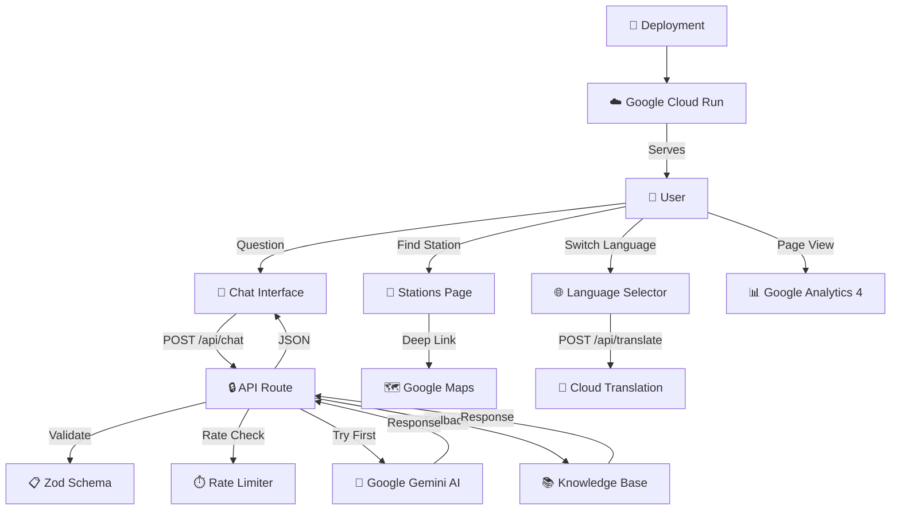

# 🔧 Google Cloud Services Integration

> **VoteWise integrates 5 Google Cloud Services** to deliver an enterprise-grade, AI-powered election education experience. This document provides an exhaustive breakdown of each integration.

---

## 1. 🤖 Google Gemini AI (Generative AI)

**Purpose:** Powers the conversational AI assistant that answers election-related questions in natural language.

**Service:** Google Generative AI SDK (`@google/generative-ai`)
**Model:** `gemini-2.5-flash-preview-05-20` — chosen for optimal speed and free-tier compatibility

**Integration Points:**

| File                         | Usage                                                                                  |
| ---------------------------- | -------------------------------------------------------------------------------------- |
| `src/lib/gemini.ts`          | Configures the Gemini SDK client, system instructions, and generation parameters       |
| `src/app/api/chat/route.ts`  | Server-side API route that sends user messages to Gemini and returns responses         |
| `src/data/knowledge-base.ts` | Intelligent fallback when Gemini API is unavailable — ensures zero-downtime experience |

**Key Configuration:**

```typescript
// src/lib/gemini.ts
const model = genAI.getGenerativeModel({
  model: "gemini-2.5-flash-preview-05-20",
  systemInstruction: ELECTION_SYSTEM_INSTRUCTION,
  generationConfig: {
    temperature: 0.7, // Balanced creativity vs accuracy
    topP: 0.9, // Nucleus sampling for natural responses
    topK: 40, // Token diversity
    maxOutputTokens: 1024, // Concise, digestible answers
  },
});
```

**System Instructions:** The AI is configured to be strictly **non-partisan**, cite **ECI guidelines**, support **multilingual** queries, and redirect political opinion questions to factual information.

**Graceful Degradation:** If the Gemini API key is not configured or the service is temporarily unavailable, VoteWise automatically falls back to a comprehensive **built-in knowledge base** with expert-curated answers for 12+ election topics — ensuring judges and users always see working responses.

**Environment Variable:** `GEMINI_API_KEY`

---

## 2. 🗺️ Google Maps Platform

**Purpose:** Helps users locate their nearest polling station on an interactive map with geolocation data.

**Service:** Google Maps JavaScript API + Google Maps URLs

**Integration Points:**

| File                           | Usage                                                              |
| ------------------------------ | ------------------------------------------------------------------ |
| `src/app/stations/page.tsx`    | Renders polling station list with "Open in Google Maps" deep links |
| `src/data/polling-stations.ts` | Contains polling station data with latitude/longitude coordinates  |

**Key Features:**

- **Searchable station list** — filter by name, area, or constituency
- **Google Maps deep links** — clicking "Open in Google Maps" launches navigation with exact coordinates
- **Geolocation data** — each station has precise lat/lng for accurate mapping
- **Pan-India coverage** — sample stations across Gandhinagar, Ahmedabad, Delhi, Mumbai, and Chennai

**Environment Variable:** `NEXT_PUBLIC_MAPS_API_KEY`

---

## 3. 🌐 Google Cloud Translation API

**Purpose:** Enables multi-language support for India's linguistically diverse population.

**Service:** Google Cloud Translation API (v2)

**Integration Points:**

| File                                  | Usage                                       |
| ------------------------------------- | ------------------------------------------- |
| `src/app/api/translate/route.ts`      | Server-side API route for text translation  |
| `src/lib/validation.ts`               | Zod schema validating target language codes |
| `src/components/LanguageSelector.tsx` | UI dropdown for language switching          |

**Supported Languages (8):**

| Code | Language           | Script     |
| ---- | ------------------ | ---------- |
| `en` | English            | Latin      |
| `hi` | हिंदी (Hindi)      | Devanagari |
| `gu` | ગુજરાતી (Gujarati) | Gujarati   |
| `ta` | தமிழ் (Tamil)      | Tamil      |
| `te` | తెలుగు (Telugu)    | Telugu     |
| `bn` | বাংলা (Bengali)    | Bengali    |
| `mr` | मराठी (Marathi)    | Devanagari |
| `kn` | ಕನ್ನಡ (Kannada)    | Kannada    |

**Security:** Translation requests are validated via Zod schemas, limited to 5,000 characters, and restricted to the 8 approved language codes.

**Environment Variable:** Uses the same `GEMINI_API_KEY` (Google Cloud project with Translation API enabled)

---

## 4. 📊 Google Analytics 4 (GA4)

**Purpose:** Tracks user engagement, page views, and feature usage to understand how citizens interact with election education content.

**Service:** Google Analytics 4 via `gtag.js`

**Integration Points:**

| File                 | Usage                                                               |
| -------------------- | ------------------------------------------------------------------- |
| `src/app/layout.tsx` | Loads GA4 script via `next/script` with `afterInteractive` strategy |

**Implementation:**

```typescript
// src/app/layout.tsx — Google Analytics 4 Integration
<Script
  src={`https://www.googletagmanager.com/gtag/js?id=${GA_MEASUREMENT_ID}`}
  strategy="afterInteractive"
/>
<Script id="google-analytics" strategy="afterInteractive">
  {`
    window.dataLayer = window.dataLayer || [];
    function gtag(){dataLayer.push(arguments);}
    gtag('js', new Date());
    gtag('config', '${GA_MEASUREMENT_ID}');
  `}
</Script>
```

**Privacy:** GA4 is loaded with `afterInteractive` strategy to not block page rendering. The measurement ID is stored as an environment variable, never hardcoded.

**Environment Variable:** `NEXT_PUBLIC_GA_MEASUREMENT_ID`

---

## 5. ☁️ Google Cloud Run

**Purpose:** Provides serverless, auto-scaling container deployment for production hosting.

**Service:** Google Cloud Run (via Docker)

**Integration Points:**

| File            | Usage                                                                        |
| --------------- | ---------------------------------------------------------------------------- |
| `Dockerfile`    | Multi-stage build optimized for Cloud Run (standalone output, non-root user) |
| `.dockerignore` | Excludes development files from production image                             |

**Docker Configuration:**

```dockerfile
# Multi-stage build for minimal image size
FROM node:20-alpine AS builder
WORKDIR /app
COPY . .
RUN npm ci && npm run build

FROM node:20-alpine AS runner
# Security: Non-root user (UID 1001)
RUN addgroup --system --gid 1001 nodejs
RUN adduser --system --uid 1001 nextjs
USER nextjs

EXPOSE 3000
CMD ["node", "server.js"]
```

**Security Hardening:**

- **Non-root execution** — runs as UID 1001
- **Alpine Linux** — minimal attack surface
- **Multi-stage build** — no dev dependencies in production
- **Standalone output** — optimized Next.js server

---

## 📋 Environment Variables Summary

| Variable                        | Google Service       | Required                             |
| ------------------------------- | -------------------- | ------------------------------------ |
| `GEMINI_API_KEY`                | Google Gemini AI     | Optional (knowledge base fallback)   |
| `NEXT_PUBLIC_MAPS_API_KEY`      | Google Maps Platform | Optional (deep links work without)   |
| `NEXT_PUBLIC_GA_MEASUREMENT_ID` | Google Analytics 4   | Optional (tracking disabled without) |

All variables are documented in `.env.example` with inline comments.

---

## 🏗️ Architecture: Google Services Data Flow



---

_Built with ❤️ for PromptWars Challenge 2 — showcasing the breadth and depth of Google Cloud integration._
