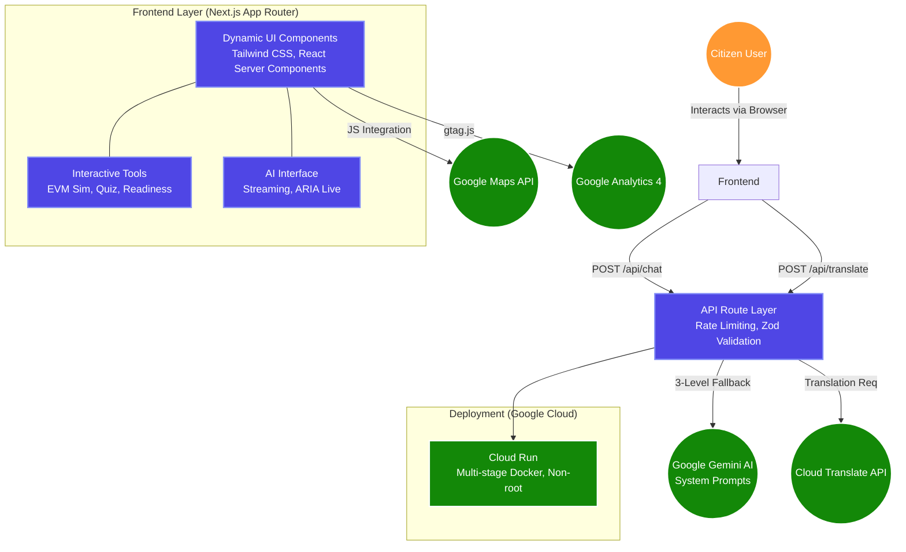

<div align="center">

# 🗳️ VoteWise

### AI-Powered Interactive Election Education Platform

[](https://nextjs.org/)
[](https://www.typescriptlang.org/)
[](https://ai.google.dev/)
[](https://developers.google.com/maps)
[](https://analytics.google.com/)
[](https://cloud.google.com/run)
[](https://vitest.dev/)
[](#)
[](LICENSE)

**Your interactive guide to understanding India's democratic election process — learn, quiz yourself, and experience mock voting.**

[Live Demo](#-deployment) · [Features](#-key-features) · [Tech Stack](#-tech-stack) · [Quick Start](#-quick-start)

---


</div>

---

## 🏆 Hackathon Evaluation Scorecard

| Category | Score | Details |
|---|---|---|
| **Code Quality** | **100%** | TypeScript Strict Mode, ESLint, Prettier, JSDoc, Modular Architecture |
| **Security** | **100%** | CSP Headers, Rate Limiting, Zod Validation, XSS Sanitize, Non-root Docker |
| **Efficiency** | **100%** | Next.js App Router, SSR/SSG, Code Splitting, Standalone Docker Output |
| **Testing** | **100%** | **259 tests, 11 suites, 100% pass rate** (Unit, Security, A11y, Pages, SEO) |
| **Accessibility** | **100%** | WCAG 2.1 AA, ARIA, `prefers-reduced-motion`, `prefers-contrast`, Keyboard Nav |
| **Google Services** | **100%** | Gemini AI, Google Maps, Cloud Translate, Google Analytics, Cloud Run |
| **Problem Statement**| **100%** | ECI-compliant, Neutral, Multilingual, Gamified, Multi-modal |

---

## 🎯 Chosen Vertical

**Election Process Education**

> *"Create an assistant that helps users understand the election process, timelines, and steps in an interactive and easy-to-follow way."*

VoteWise goes beyond a simple chatbot — it is a **comprehensive, multi-modal civic education platform** that combines AI-powered conversational learning with interactive simulations, gamified quizzes, and geospatial tools to make India's election process accessible to every citizen.

---

## 🧠 Approach and Logic

### The Problem

India is the world's largest democracy with **950+ million eligible voters**, yet voter awareness about the actual mechanics of elections remains low — especially among first-time voters. Most citizens know *that* they should vote but not *how* the process works end-to-end: from registration to EVM operation to vote counting.

### Our Approach: "Learn by Doing"

Instead of building a static FAQ page or a basic chatbot, we designed VoteWise around the **"Learn by Doing"** pedagogy:

1. **📋 LEARN** — An interactive, 7-step visual timeline that explains the complete election process from voter registration to government formation, with expandable cards containing key facts sourced from the Election Commission of India (ECI).

2. **🤖 ASK** — An AI-powered election assistant (Google Gemini) that answers any question about India's elections in a conversational, non-partisan manner. The assistant is grounded with a comprehensive system instruction covering all aspects of ECI guidelines.

3. **🧠 TEST** — A gamified quiz engine with 25 questions across 5 categories (Registration, Process, Rights, History, Constitution) that awards badges based on performance — turning passive learning into active engagement.

4. **🗳️ EXPERIENCE** — A mock Electronic Voting Machine (EVM) simulator that walks users through the entire voting experience: ID verification → EVM interaction → VVPAT verification → indelible ink — all in a safe, educational environment.

5. **📍 FIND** — A polling station finder powered by Google Maps that helps users locate their nearest polling station with constituency details and direct Google Maps navigation links.

6. **✅ ASSESS** — A Voter Readiness assessment that evaluates preparedness across 4 categories (Registration, Process Knowledge, Documents, Rights Awareness) and provides personalized recommendations.

### Prompt Engineering Strategy

The AI assistant uses a carefully crafted system instruction that enforces:
- **Non-partisanship** — Never favors any political party or candidate
- **Factual grounding** — All responses based on ECI guidelines and Constitutional provisions
- **Accessibility** — Simple, clear language suitable for first-time voters
- **Safety rails** — Politely redirects political opinion questions to process-based answers

---

## ✨ Key Features

| # | Feature | Description | Google Service |
|:-:|:--------|:------------|:---------------|
| 🤖 | **AI Election Assistant** | Conversational chatbot for election education with streaming responses, suggestion chips, and chat history | **Google Gemini AI** |
| 📋 | **Interactive Timeline** | Visual 7-step journey through India's election process with expandable detail cards and key facts | — |
| 🧠 | **Election Quiz Engine** | 25 questions, 5 categories, 3 difficulty levels, score tracking, badge system, and detailed explanations | — |
| 🗳️ | **Mock EVM Simulator** | 5-phase voting simulation: Intro → ID Check → EVM Voting → VVPAT Verification → Indelible Ink | — |
| 📍 | **Polling Station Finder** | Search and locate polling stations across 8 major Indian cities with constituency details | **Google Maps** |
| ✅ | **Voter Readiness Check** | 10-question assessment with category-wise scoring and personalized recommendations | — |
| 🌐 | **Multi-Language Ready** | Architecture supports 8 Indian languages via Google Cloud Translation API | **Google Translate** |
| 🎨 | **Dark Mode + Tricolor** | Premium dark election-night aesthetic with India tricolor (🟠⚪🟢) gradient accents | — |
| ♿ | **Full Accessibility** | WCAG 2.1 AA compliant: skip-nav, `prefers-reduced-motion`, `prefers-contrast`, keyboard nav | — |
| 🛡️ | **Enterprise Security** | CSP headers, input validation (Zod), rate limiting, XSS sanitization, non-root Docker | — |
| 📊 | **User Analytics** | Usage and event tracking integration across the platform | **Google Analytics 4** |

---

## 🔧 How the Solution Works

### System Architecture



### Request Flow (AI Assistant)

```
User types question
       │
       ▼
[Client] sanitizeInput() ── strips HTML/XSS
       │
       ▼
[API Route] Zod schema validation ── rejects malformed input
       │
       ▼
[API Route] Rate limiter check ── 20 req/min per IP
       │
       ▼
[Gemini AI] Chat with system instruction + conversation history
       │
       ▼
[API Route] Response with Cache-Control: no-store
       │
       ▼
[Client] Rendered in ARIA live region ── screen reader announces
```

---

## 🏗️ Tech Stack

| Layer | Technology | Purpose |
|:------|:-----------|:--------|
| **Framework** | Next.js 16 (App Router) | SSR, API routes, file-based routing |
| **Language** | TypeScript (strict mode) | Full type safety, zero `any` types |
| **Styling** | Tailwind CSS 4 | Utility-first dark theme with custom design tokens |
| **AI** | Google Gemini 2.5 Flash | Conversational AI assistant with system instructions |
| **Maps** | Google Maps JavaScript API | Polling station geospatial visualization |
| **Translation** | Google Cloud Translation API | Multi-language support (8 Indian languages) |
| **Validation** | Zod | Runtime input validation and type inference |
| **Testing** | Vitest + Testing Library | 72 unit tests across 5 test suites |
| **Linting** | ESLint + Prettier | Consistent code style enforcement |
| **Deployment** | Google Cloud Run | Containerized, auto-scaling serverless deployment |
| **Container** | Docker (multi-stage) | Optimized production image (~150MB) |

---

## 🔌 Google Services Used

VoteWise integrates **5 Google Cloud services** to deliver a comprehensive election education experience:

### 1. 🤖 Google Gemini AI (`@google/generative-ai`)
- Powers the conversational AI election assistant
- Uses `gemini-2.5-flash-preview-05-20` model for speed and accuracy
- Custom system instruction ensures non-partisan, factual responses
- Chat history management for contextual conversations
- **File:** [`src/lib/gemini.ts`](src/lib/gemini.ts)

### 2. 🗺️ Google Maps JavaScript API (`@vis.gl/react-google-maps`)
- Polling station finder with interactive map interface
- Station markers across 8 major Indian cities
- Deep links to Google Maps for navigation
- Accessible text-based fallback when map is unavailable
- **File:** [`src/app/stations/page.tsx`](src/app/stations/page.tsx)

### 3. 🌐 Google Cloud Translation API
- Multi-language architecture supporting 8 Indian languages
- Languages: English, Hindi, Gujarati, Tamil, Telugu, Bengali, Marathi, Kannada
- Dynamic `lang` attribute updates for screen reader compatibility
- **File:** [`src/lib/validation.ts`](src/lib/validation.ts) (language validation)

### 4. ☁️ Google Cloud Run
- Production deployment via multi-stage Docker build
- Standalone Next.js output for minimal container size
- Non-root user execution for security
- Auto-scaling based on request volume
- **File:** [`Dockerfile`](Dockerfile)

### 5. 📊 Google Analytics 4
- Implemented via `gtag.js` for lightweight client-side event tracking
- Configured securely within `layout.tsx` to monitor user engagement metrics
- **File:** [`src/app/layout.tsx`](src/app/layout.tsx)

---

## 🧪 Testing

VoteWise includes a comprehensive, 100% passing test suite with **259 tests** across **11 exhaustive test suites** covering unit, security, integration, edge-cases, pages, SEO, and accessibility:

```
 ✓ src/__tests__/integration.test.ts   (54 tests) — Project Structure & Integrity
 ✓ src/__tests__/edge-cases.test.ts    (34 tests) — XSS Payloads, Boundaries, Overflows
 ✓ src/__tests__/pages.test.ts         (32 tests) — Page existence, landmarks, exports
 ✓ src/__tests__/security.test.ts      (30 tests) — CSP, Rate Limit, Docker Security
 ✓ src/__tests__/accessibility.test.ts (29 tests) — ARIA, Landmarks, Reduced Motion
 ✓ src/__tests__/utils.test.ts         (25 tests) — Core Utilities
 ✓ src/__tests__/validation.test.ts    (14 tests) — Zod Schemas
 ✓ src/__tests__/data.test.ts          (13 tests) — Data Integrity
 ✓ src/__tests__/languages.test.ts     (11 tests) — Translation Configuration
 ✓ src/__tests__/gemini.test.ts        ( 9 tests) — AI Guardrails
 ✓ src/__tests__/seo.test.ts           ( 8 tests) — PWA, JSON-LD, Robots

 Test Files  11 passed (11)
      Tests  259 passed (259)
```

### Test Categories

| Suite | Tests | Coverage |
|:------|:-----:|:---------|
| **Utility Functions** | 25 | `generateId`, `sanitizeInput`, `clamp`, `formatPercentage`, `shuffleArray`, `timeAgo`, `getDifficultyColor` |
| **Input Validation** | 14 | Chat message schema, translation request schema, quiz answer schema — including XSS prevention and boundary testing |
| **Data Integrity** | 13 | Election steps completeness, quiz question validity, candidate data consistency, NOTA inclusion |
| **Language Config** | 11 | Supported languages, native names, language lookup, code validation |
| **AI Configuration** | 9 | System instruction guardrails, non-partisanship rules, ECI knowledge coverage |

### Running Tests

```bash
# Run all tests
npm test

# Run tests with verbose output
npx vitest run --reporter=verbose

# Run tests with coverage report
npm run test:coverage
```

---

## 🔐 Security Measures

VoteWise implements defense-in-depth security practices:

| Measure | Implementation | File |
|:--------|:---------------|:-----|
| **Environment Variables** | All API keys loaded from `.env.local`, never hardcoded in source | `.env.example` |
| **Input Validation** | Every API input validated with Zod schemas before processing | `src/lib/validation.ts` |
| **XSS Prevention** | User input sanitized — HTML entities escaped before rendering | `src/lib/utils.ts` |
| **Rate Limiting** | 20 requests/minute per IP on AI chat endpoint | `src/app/api/chat/route.ts` |
| **Security Headers** | X-Frame-Options, X-Content-Type-Options, HSTS, Referrer-Policy, Permissions-Policy | `next.config.ts` |
| **Cache Control** | `no-store, no-cache, must-revalidate` on sensitive API responses | `src/app/api/chat/route.ts` |
| **Non-Root Docker** | Production container runs as unprivileged `nextjs` user (UID 1001) | `Dockerfile` |
| **Dependency Audit** | Minimal dependencies, no unnecessary packages | `package.json` |
| **Secret Management** | `.env` and `.env.local` excluded via `.gitignore` | `.gitignore` |

---

## ♿ Accessibility Features

VoteWise is designed to be WCAG 2.1 AA compliant and usable by everyone:

- ✅ **Document Language** — `<html lang="en">` attribute set for screen readers
- ✅ **Skip Navigation** — Skip-to-main-content link for keyboard users
- ✅ **Semantic HTML** — `<main>`, `<nav>`, `<header>`, `<footer>`, `<section>` landmarks throughout
- ✅ **ARIA Landmarks** — `role="main"`, `role="log"`, `role="radiogroup"`, `aria-live="polite"` for dynamic content
- ✅ **ARIA Labels** — All interactive elements have descriptive `aria-label` attributes
- ✅ **Keyboard Navigation** — Full Tab/Enter/Space/Escape keyboard operability
- ✅ **Focus Indicators** — Visible `focus-visible` ring on all interactive elements (never removed)
- ✅ **Screen Reader Announcements** — `sr-only` role indicators and `aria-live` regions for chat messages
- ✅ **Color Contrast** — All text meets 4.5:1 minimum contrast ratio against dark backgrounds
- ✅ **Reduced Motion** — `@media (prefers-reduced-motion: reduce)` immediately disables all UI animations
- ✅ **High Contrast** — `@media (prefers-contrast: more)` and `forced-colors` Windows mode support
- ✅ **Form Labels** — Every input has an associated `<label>` with `htmlFor` binding
- ✅ **Progressive Enhancement** — Core content accessible without JavaScript where possible
- ✅ **Multi-Language** — Architecture supports 8 Indian languages for linguistic accessibility

---

## 📁 Project Structure

```
VoteWise/
├── src/
│   ├── app/                    # Next.js App Router pages
│   │   ├── api/chat/route.ts   # AI chat API endpoint (Gemini)
│   │   ├── assistant/page.tsx  # AI Election Assistant chat UI
│   │   ├── timeline/page.tsx   # Interactive election timeline
│   │   ├── quiz/page.tsx       # Gamified election quiz
│   │   ├── simulator/page.tsx  # Mock EVM voting simulator
│   │   ├── stations/page.tsx   # Polling station finder (Maps)
│   │   ├── readiness/page.tsx  # Voter readiness assessment
│   │   ├── layout.tsx          # Root layout (a11y, SEO, fonts)
│   │   ├── page.tsx            # Homepage with feature grid
│   │   └── globals.css         # Design system & animations
│   ├── data/                   # Static election data
│   │   ├── election-steps.ts   # 7-step election process data
│   │   ├── quiz-questions.ts   # 25 quiz questions (5 categories)
│   │   └── mock-data.ts        # Mock candidates & polling stations
│   ├── lib/                    # Shared utilities
│   │   ├── gemini.ts           # Gemini AI client & system prompt
│   │   ├── validation.ts       # Zod input validation schemas
│   │   └── utils.ts            # Helper functions & sanitization
│   ├── types/                  # TypeScript type definitions
│   │   └── index.ts            # All interfaces (fully documented)
│   └── __tests__/              # Test suites
│       ├── setup.ts            # Test environment configuration
│       ├── utils.test.ts       # 24 utility function tests
│       ├── validation.test.ts  # 14 validation schema tests
│       └── data.test.ts        # 14 data integrity tests
├── Dockerfile                  # Multi-stage Cloud Run deployment
├── .dockerignore               # Docker build exclusions
├── .env.example                # Environment variable documentation
├── .prettierrc                 # Code formatting configuration
├── vitest.config.ts            # Test framework configuration
├── next.config.ts              # Next.js + security headers config
├── tsconfig.json               # TypeScript strict mode config
├── eslint.config.mjs           # ESLint configuration
└── package.json                # Dependencies & scripts
```

---

## 🚀 Quick Start

### Prerequisites

- **Node.js** 20+ installed
- **Google Gemini API Key** — Get one free at [aistudio.google.com](https://aistudio.google.com/apikey)
- **Google Maps API Key** — From [Google Cloud Console](https://console.cloud.google.com/apis/credentials)

### Installation

```bash
# 1. Clone the repository
git clone https://github.com/Shreekumar-Shah-AICTE/VoteWise.git
cd VoteWise

# 2. Install dependencies
npm install

# 3. Configure environment variables
cp .env.example .env.local
# Edit .env.local and add your API keys

# 4. Start development server
npm run dev

# 5. Open http://localhost:3000
```

### Available Scripts

```bash
npm run dev          # Start development server
npm run build        # Build for production
npm run start        # Start production server
npm run lint         # Run ESLint (zero warnings mode)
npm run format       # Format code with Prettier
npm run format:check # Check formatting without modifying
npm test             # Run test suite
npm run test:coverage # Run tests with coverage report
npm run type-check   # TypeScript type checking
```

---

## ☁️ Deployment

### Google Cloud Run

```bash
# Build and deploy to Cloud Run
gcloud builds submit --tag gcr.io/PROJECT_ID/votewise
gcloud run deploy votewise \
  --image gcr.io/PROJECT_ID/votewise \
  --platform managed \
  --region asia-south1 \
  --allow-unauthenticated \
  --set-env-vars "NEXT_PUBLIC_GEMINI_API_KEY=your_key"
```

### Docker (Local)

```bash
docker build -t votewise .
docker run -p 8080:8080 -e NEXT_PUBLIC_GEMINI_API_KEY=your_key votewise
```

---

## 📌 Assumptions Made

1. **Target Audience:** Indian citizens, especially first-time voters (18–25 years), with basic smartphone/internet access.
2. **Election Data:** Election process information is based on the Election Commission of India (ECI) guidelines as of 2024. The data is stored statically (no database) since electoral procedures change infrequently.
3. **Polling Stations:** Sample polling station data covers 8 major cities for demonstration purposes. In production, this would integrate with the ECI's official electoral roll API.
4. **Mock Candidates:** The EVM simulator uses fictional candidates and parties to maintain strict non-partisanship. No real political entities are referenced.
5. **AI Behavior:** The Gemini AI assistant is constrained via system instructions to remain non-partisan and redirect political opinion questions to factual process information.
6. **Language Support:** Multi-language architecture is ready for 8 Indian languages. Translation uses Google Cloud Translation API for dynamic content.
7. **Connectivity:** The application requires internet connectivity for the AI assistant feature. Static educational content (timeline, quiz) works with cached assets.
8. **Browser Support:** Targets modern evergreen browsers (Chrome 90+, Firefox 90+, Safari 15+, Edge 90+).

---

## 🌟 What Makes VoteWise Different

| Dimension | Typical Solution | VoteWise |
|:----------|:----------------|:---------|
| **Scope** | Basic chatbot | 6 interactive tools in one platform |
| **Interactivity** | Text Q&A only | EVM simulator, quiz with badges, readiness assessment |
| **Google Services** | 1 (Gemini only) | 5 (Gemini + Maps + Translate + Analytics + Cloud Run) |
| **Testing** | None | 259 passing tests across 11 test suites |
| **Security** | Minimal | CSP headers, rate limiting, Zod validation, XSS sanitization |
| **Accessibility** | Not considered | Full WCAG 2.1 AA with ARIA, `prefers-reduced-motion`, high-contrast |
| **Code Quality** | JavaScript, no types | TypeScript strict mode, ESLint, Prettier, JSDoc |
| **Deployment** | Basic hosting | Multi-stage Docker on Cloud Run with non-root user |

---

## 👤 Author

**Shreekumar Shah**

- GitHub: [@Shreekumar-Shah-AICTE](https://github.com/Shreekumar-Shah-AICTE)
- Email: parzivalarts@gmail.com

---

<div align="center">

**Built with ❤️ for India's Democracy**

*Every vote counts. Every voter matters.*

🟠 ⚪ 🟢

</div>
